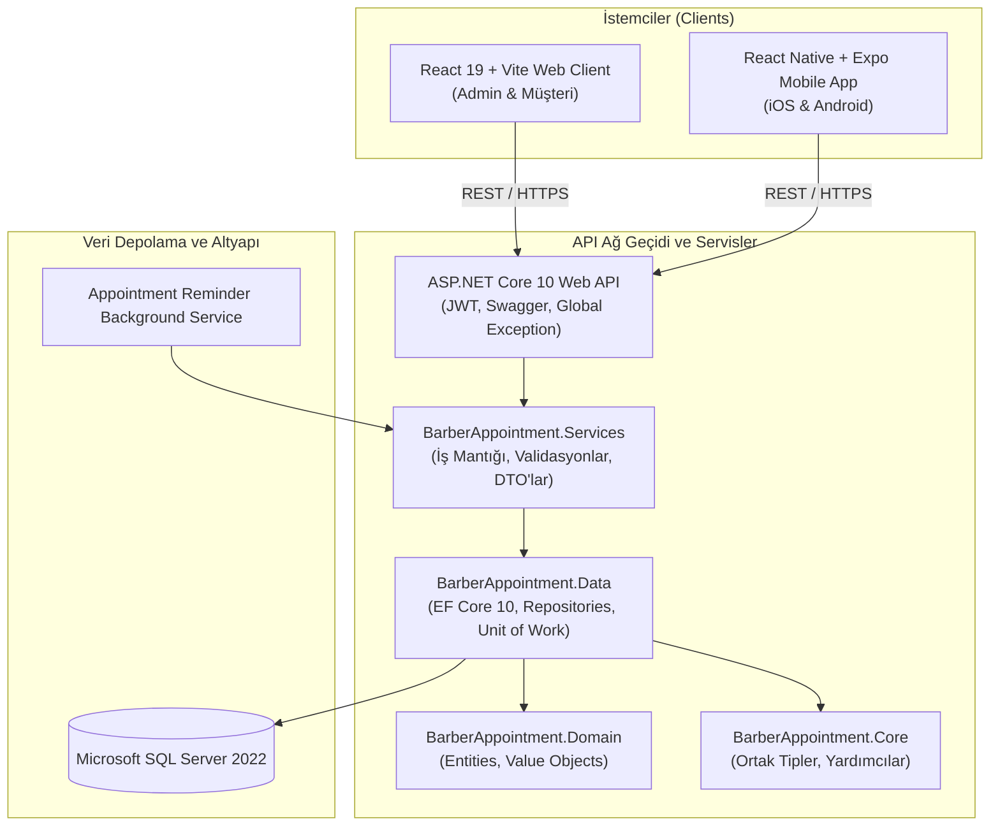

# BarberAppointment ✂️💈

> **Modern, Kurumsal ve Çok Platformlu Kuaför & Berber Randevu Yönetim Sistemi**  
> ASP.NET Core 10 REST API, React 19 Web Yönetim & Müşteri Paneli ve React Native / Expo Mobil Uygulaması.

---

## 📋 İçindekiler

- [Genel Bakış](#-genel-bakış)
- [Öne Çıkan Özellikler](#-öne-çıkan-özellikler)
- [Mimari ve Teknoloji Yığını](#-mimari-ve-teknoloji-yığını)
- [Proje Dizin Yapısı](#-proje-dizin-yapısı)
- [İş Kuralları ve Algoritmalar](#-iş-kuralları-ve-algoritmalar)
- [Kurulum ve Çalıştırma](#-kurulum-ve-çalıştırma)
  - [Ön Gereksinimler](#ön-gereksinimler)
  - [1. Docker Compose ile Hızlı Başlatma (Önerilen)](#1-docker-compose-ile-hızlı-başlatma-önerilen)
  - [2. Yerel Geliştirme Ortamı (Manuel Başlatma)](#2-yerel-geliştirme-ortamı-manuel-başlatma)
- [Demo ve Test Kullanıcı Hesapları](#-demo-ve-test-kullanıcı-hesapları)
- [Konfigürasyon ve Ortam Değişkenleri](#-konfigürasyon-ve-ortam-değişkenleri)
- [API Dokümantasyonu ve Sağlık Kontrolleri](#-api-dokümantasyonu-ve-sağlık-kontrolleri)
- [Testler ve Kalite Güvencesi](#-testler-ve-kalite-güvencesi)
- [Dokümantasyon Arşivi](#-dokümantasyon-arşivi)

---

## 🌟 Genel Bakış

**BarberAppointment**, berber ve kuaför salonlarının operasyonel iş yükünü hafifletmek, müşterilere modern ve akıcı bir randevu deneyimi sunmak, işletme sahiplerine ise gerçek zamanlı yönetim ve ciro takibi olanağı sağlamak amacıyla geliştirilmiş uçtan uca randevu yönetim sistemidir.

Sistem; mikroservis hazırlığında tasarlanmış N-Tier / Clean Architecture backend mimarisi, React 19 tabanlı modern web arayüzü ve React Native / Expo tabanlı çapraz platform (iOS & Android) mobil uygulamadan oluşur.

---

## ✨ Öne Çıkan Özellikler

### 👤 Müşteri Deneyimi (Web & Mobil)
- **Adım Adım Randevu Sihirbazı (Wizard Flow):**
  - Hizmet seçimi, kuaför seçimi, dinamik tarih/saat slotu seçimi ve onay özeti.
- **Çoklu Hizmet ve Kompozit Paket Desteği:**
  - Tek randevuda birden fazla hizmet (örn. Saç Kesimi + Sakal Tıraşı + Cilt Bakımı) veya indirimli kompozit paket seçimi.
  - Kompozit paketler ile alt hizmetler arasında karşılıklı dışlama (mutual exclusion) denetimi.
- **Uzman Berber Kadrosu İnceleme:**
  - Personellerin unvanları, mesai saatleri, izin günleri ve verdikleri hizmetleri detaylı modal/kart görünümünde inceleme; doğrudan berber üzerinden randevu başlatma.
- **SMS & E-Posta Bildirimleri:**
  - SMS OTP doğrulama kodu entegrasyonu, randevu onay ve iptal bildirimleri, şifre sıfırlama e-postaları.
- **Randevu Takibi & Canlı Durum:**
  - Yaklaşan ve geçmiş randevuları listeleme, randevu vaktine kalan süreyi dinamik hesaplama (`⏳ 2 saat sonra`) ve güvenli iptal seçeneği.
- **Modern Tema & Erişilebilirlik:**
  - Altın/Amber vurgulu lüks koyu tema ve aydınlık/karanlık mod geçişi.

### 👑 Yönetici & Personel Paneli (Admin & Employee)
- **Yönetim Paneli & KPI Metrikleri:**
  - Toplam randevu adedi, ciro analizi, aktif personel ve aktif hizmet metrik kartları.
- **Gelişmiş Randevu Yönetimi:**
  - Randevuları tarihe, personele ve duruma göre çok kriterli filtreleme.
  - Randevuları varsayılan olarak en yakın tarihten itibaren kronolojik sıralama, onaylama, tamamlama ve iptal etme.
- **Personel & İzin Yönetimi:**
  - Kuaför ekleme/düzenleme, uzmanlık ve hizmet yetkisi (`Checklist`) atama.
  - Haftalık çalışma günleri, mesai saatleri ve personel izin (Leave Request) taleplerinin onayı/reddi.
- **Hizmet Kataloğu Yönetimi:**
  - Standart ve kompozit paket CRUD işlemleri, süre (dakika) ve fiyat (₺) optimizasyonu.
- **Denetim Günlüğü (Audit Log):**
  - Randevu durum değişiklikleri, tarih/saat güncellemeleri ve işlem geçmişinin Türkiye saatiyle kayıt altına alınması.

---

## 🏗 Mimari ve Teknoloji Yığını



### Backend
- **Framework:** .NET 10 / C# 13, ASP.NET Core Web API
- **ORM & Veritabanı:** Entity Framework Core 10, Microsoft SQL Server 2022
- **Mimari:** N-Tier / Clean Architecture, Generic Repository & Unit of Work Pattern, Inversion of Control (IoC)
- **Doğrulama & Hata Yönetimi:** FluentValidation, Global Exception Handling Middleware, Standart `ApiResponse<T>`
- **Kimlik Doğrulama:** Stateless JWT (JSON Web Token), HMAC-SHA512 Password Hashing, Rol Tabanlı Yetkilendirme (RBAC)
- **Arka Plan Görevleri:** `BackgroundService` ile zamanlanmış randevu hatırlatıcıları (Notification Processor)
- **Dokümantasyon & İzleme:** Swagger / OpenAPI, Health Checks (`/health`, `/health/live`, `/health/ready`)

### Frontend (Web)
- **Kütüphane & Araçlar:** React 19, Vite, React Router
- **İstemci:** Axios (Özelleştirilmiş Interceptors, Token Enjeksiyonu, 401 Yönetimi)
- **İkon Seti & Tasarım:** Lucide React, Glassmorphism temalı responsive CSS

### Mobil Uygulama (Mobile)
- **Çatı:** React Native, Expo SDK
- **Navigasyon & Durum:** React Context API, Platform duyarlı dinamik API URL konfigürasyonu
- **Platformlar:** iOS Simulator, Android Emulator, Expo Go ile fiziksel cihazlar

---

## 📁 Proje Dizin Yapısı

```text
BarberAppointment/
├── BarberAppointment.sln                  # Ana .NET Solution dosyası
├── docker-compose.yml                     # MSSQL + Web API tek komutla container orkestrasyonu
├── Dockerfile                             # Web API üretim Docker imajı
├── src/
│   ├── libraries/
│   │   ├── BarberAppointment.Core/        # Ortak modeller, enumlar ve yardımcılar
│   │   ├── BarberAppointment.Domain/      # Veritabanı varlıkları (Entity) modelleri
│   │   ├── BarberAppointment.Data/        # EF Core DbContext, Fluent API, Repository'ler
│   │   └── BarberAppointment.Services/    # İş kuralları, DTO'lar, FluentValidation, Servisler
│   └── presentation/
│       ├── BarberAppointment.WebApi/      # REST API Controller'ları, Middleware, Swagger
│       ├── BarberAppointment.Web/         # React 19 + Vite Web uygulaması
│       └── BarberAppointment.Mobile/      # React Native & Expo mobil uygulaması
├── database/
│   └── mssql/                             # SQL şema, seed verileri ve yerel scriptler
├── tests/
│   ├── BarberAppointment.UnitTests/       # xUnit, Moq, FluentAssertions test projesi
│   └── test_all_scenarios.sh              # 22+ senaryoyu doğrulayan uçtan uca API test scripti
├── postman/                               # Postman Collection ve Dev Environment dosyaları
└── docs/                                  # Ayrıntılı teknik mimari ve gereksinim belgeleri
```

---

## ⚙️ İş Kuralları ve Algoritmalar

Sistem genelinde uygulanan kritik iş kuralları (Business Rules):

1. **Çakışma Önleme Algoritması ($[S_1, E_1) \cap [S_2, E_2) \neq \emptyset$):**
   Bir personelin mevcut randevusu $[S_1, E_1)$ ile yeni talep edilen randevu $[S_2, E_2)$ zaman aralığı karşılaştırılır. Çakışma durumunda HTTP `409 Conflict` fırlatılarak randevu engellenir.
2. **Boş Slot Hesaplama Motoru (`/api/appointments/available-slots`):**
   Personelin mesai saatleri (örn. 09:00 - 19:00), haftalık izin günleri, onaylanmış mazeret izinleri ve mevcut randevuları taranarak seçilen hizmetlerin toplam süresine uygun boş saat aralıkları anlık üretilir.
3. **Kompozit Paket ve Alt Hizmet Karşılıklı Dışlaması:**
   Kompozit paket seçildiğinde paketin alt hizmetleri, alt hizmetlerden biri seçildiğinde ise bu alt hizmeti içeren kompozit paketler seçime kapatılır.
4. **Zaman Dilimi Standartlaşması (Turkey Time / UTC+3):**
   Tüm izin tarihleri, denetim logları ve randevu zamanları `IDateTimeProvider` üzerinden Türkiye saati standardında işlenir.

---

## 🚀 Kurulum ve Çalıştırma

### Ön Gereksinimler
- [.NET 10 SDK](https://dotnet.microsoft.com/download)
- [Node.js](https://nodejs.org/) (v18 veya üzeri) & npm
- [Docker Desktop](https://www.docker.com/products/docker-desktop) *(Docker ile çalıştırma tercih edilirse)*
- [SQL Server 2022](https://www.microsoft.com/sql-server) *(Yerel kurulum tercih edilirse)*

---

### 1. Docker Compose ile Hızlı Başlatma (Önerilen)

Tüm sistemi (MSSQL Server 2022 + Web API) tek bir komutla ayağa kaldırabilirsiniz:

```bash
# Proje kök dizininde:
docker compose up --build -d
```

- **Swagger UI:** `http://localhost:5184/swagger`
- **Health Check:** `http://localhost:5184/health`

Konteynerleri durdurmak için:
```bash
docker compose down
```

---

### 2. Yerel Geliştirme Ortamı (Manuel Başlatma)

#### A) Veritabanı ve Migration
`appsettings.json` dosyasındaki bağlantı dizesini (`DefaultConnection`) MSSQL sunucunuza göre düzenleyin ve migration'ları uygulayın:

```bash
dotnet ef database update --project src/libraries/BarberAppointment.Data --startup-project src/presentation/BarberAppointment.WebApi
```

#### B) Web API'yi Başlatma (Terminal 1)
```bash
dotnet run --project src/presentation/BarberAppointment.WebApi --launch-profile http
# API http://localhost:5184 adresinde dinlemeye başlar.
```

#### C) React Web Uygulamasını Başlatma (Terminal 2)
```bash
cd src/presentation/BarberAppointment.Web
npm install
npm run dev -- --port 3000
# Web arayüzüne http://localhost:3000 adresinden erişebilirsiniz.
```

#### D) React Native Mobil Uygulamasını Başlatma (Terminal 3)
```bash
cd src/presentation/BarberAppointment.Mobile
npm install
npm start
```
- Android Emulator için klavyeden `a` tuşuna basın.
- iOS Simulator için klavyeden `i` tuşuna basın.
- Web önizlemesi için `w` tuşuna basın.
- Gerçek cihazınızda test etmek için **Expo Go** uygulaması ile terminaldeki QR kodu okutun.

---

## 🔑 Demo ve Test Kullanıcı Hesapları

Geliştirme ortamında testleri kolaylaştırmak için otomatik oluşturulan hazır hesaplar:

| Rol | E-Posta | Şifre | Açıklama |
|---|---|---|---|
| 👑 **Yönetici (Admin)** | `superadmin@example.com` | `AdminPassword123!` | Tam yetkili sistem yöneticisi |
| ✂️ **Personel (Employee)** | `ali@example.com` | `Password123!` | Kuaför / Usta paneli erişimi |
| 👤 **Müşteri (Customer)** | `burak@example.com` | `Password123!` | Randevu alma ve profil paneli |

> **İpucu:** Web ve mobil giriş ekranlarında bulunan "1-Tap Hızlı Giriş" butonlarına basarak şifre yazmadan anında giriş yapabilirsiniz.

---

## ⚙️ Konfigürasyon ve Ortam Değişkenleri

Uygulama ayarları `src/presentation/BarberAppointment.WebApi/appsettings.json` veya ortam değişkenleri (`.env`) üzerinden yapılandırılabilir:

```json
{
  "ConnectionStrings": {
    "DefaultConnection": "Server=localhost,1433;Database=BarberAppointment;User Id=sa;Password=Your_Password;TrustServerCertificate=True"
  },
  "Jwt": {
    "Key": "Super_Secret_Key_For_JWT_Authentication_2026_Minimum_32_Chars!",
    "Issuer": "BarberAppointment",
    "Audience": "BarberAppointmentClient",
    "ExpireMinutes": 1440
  },
  "EmailSettings": {
    "Host": "sandbox.smtp.mailtrap.io",
    "Port": 2525,
    "SenderEmail": "noreply@barberappointment.com",
    "SenderName": "BarberAppointment"
  }
}
```

---

## 📖 API Dokümantasyonu ve Sağlık Kontrolleri

Web API ayağa kalktığında aşağıdaki uç noktalar aktif olur:

- **Swagger UI:** `http://localhost:5184/swagger`
- **Genel Sağlık Kontrolü:** `http://localhost:5184/health`
- **Liveness Probe (Canlılık):** `http://localhost:5184/health/live`
- **Readiness Probe (Veritabanı Hazırlığı):** `http://localhost:5184/health/ready`

### Başlıca API Modülleri:
- `/api/auth`: Kayıt olma, giriş yapma, profil sorgulama, şifre değiştirme.
- `/api/appointments`: Randevu oluşturma, filtreleme, yeniden zamanlama, tamamlama, iptal ve boş slot hesaplama.
- `/api/services`: Standart ve kompozit hizmetlerin yönetimi.
- `/api/employees`: Personel bilgileri, hizmet yetkilendirmesi, çalışma günleri ve saatleri.
- `/api/employee-leaves`: Personel izin talepleri ve yönetici onay mekanizması.
- `/api/sms`: Telefon doğrulama kodu gönderimi ve OTP doğrulama.

---

## 🧪 Testler ve Kalite Güvencesi

Proje; iş kurallarını, çakışma algoritmalarını ve yetkilendirmeleri güvence altına alan kapsamlı test paketlerine sahiptir:

```bash
# Birim testleri çalıştırma (82+ Test)
dotnet test

# Uçtan uca senaryo test scriptini çalıştırma
bash tests/test_all_scenarios.sh
```

---

## 📚 Dokümantasyon Arşivi

Projenin tasarım, veritabanı ve araştırma süreçlerine dair detaylı belgeler `docs/` dizininde yer almaktadır:

- [Veritabanı Tasarımı ve ER Diyagramı](docs/Gun3-Veritabani-Tasarimi.md) | [ER Diyagramı Kaynağı (Mermaid)](docs/er-diagram.mmd)
- [Gereksinimler ve Use-Case Analizleri](docs/Use-Cases.md)
- [Katmanlı Mimari ve Çözüm Yapısı](docs/Gun4-Dotnet-Solution-ve-Katmanli-Mimari.md)
- [Randevu İş Kuralları ve Çakışma Yönetimi](docs/Gun9-Randevu-Modulu-Business-Rules.md)
- [Proje Sunum Rehberi](docs/PROJE-SUNUM-REHBERI.md)
- [E-Posta ve SMS Doğrulama Altyapısı](docs/Ek-Gelistirme-3-SMS-Dogrulama-Altyapisi.md)

---

## 📄 Lisans

Bu proje eğitim ve geliştirme amaçlı hazırlanmıştır. Tüm hakları saklıdır.
