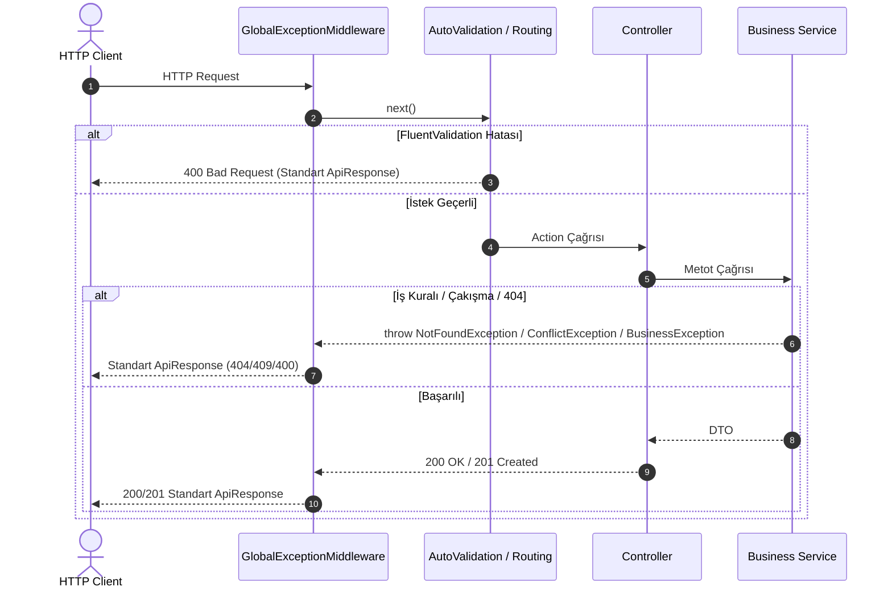

# Gün 10 — Validation ve Global Exception Handling

## 1. Araştırılan Konular

### 1.1. Neden FluentValidation? (DataAnnotations vs FluentValidation)

ASP.NET Core'da model doğrulama için iki temel yaklaşım bulunur:

| Karşılaştırma Kriteri | DataAnnotations (`[Required]`, `[StringLength]`) | FluentValidation (Önerilen & Uygulanan) |
| :--- | :--- | :--- |
| **Separation of Concerns (SoC)** | ❌ DTO sınıfı validasyon nitelikleriyle kirletilir. | ✅ Validasyon mantığı DTO'dan tamamen ayrı validator sınıflarında tutulur. |
| **Karmaşık İş Kuralları** | ❌ Çoklu alan bağımlılıkları veya koşullu validasyonlar zordur. | ✅ `When()`, `Unless()`, `Must()`, zincirleme (`RuleFor`) ile son derece esnektir. |
| **Test Edilebilirlik** | ❌ Controller/ModelBinder olmadan izole test etmek zordur. | ✅ `validator.TestValidate(dto)` ile saf unit test yazılabilir. |
| **Lokalizasyon / Hata Mesajları** | ⚠️ Sabit string veya Resource dosyası gerektirir. | ✅ Dinamik ve parametrik hata mesajları (`WithMessage()`) kolayca tanımlanır. |

---

### 1.2. ASP.NET Core Middleware Mimarisi & Global Exception Handling

Middleware bileşenleri, HTTP istek/yanıt hattında (`Request Pipeline`) ardışık olarak çalışan yazılım katmanlarıdır.



**Temel Avantajı:** Controller metotları içerisindeki `try-catch` blokları tamamen ortadan kaldırılır (DRY prensibi). Beklenmeyen 500 hataları dahil tüm istisnalar merkezi tek bir noktadan yakalanıp loglanır ve güvenli JSON çıktısına dönüştürülür.

---

### 1.3. HTTP Status Kodları Standartları

Sistemimizde kullanılan HTTP durum kodları ve anlamları:

| HTTP Kod | Durum Adı | Kullanım Yeri / Exception Türü |
| :--- | :--- | :--- |
| `200 OK` | Başarılı İstek | GET, PUT, DELETE sorgularının başarılı tamamlanması |
| `201 Created` | Kaynak Oluşturuldu | POST işlemlerinde yeni kayıt eklendiğinde (`Location` başlığıyla) |
| `400 Bad Request` | Geçersiz İstek | FluentValidation hataları, iş kuralı ihlalleri (`BusinessException`, `AppValidationException`) |
| `401 Unauthorized` | Yetkisiz Erişim | Giriş yapılmamış veya kimlik doğrulanamamış istekler |
| `404 Not Found` | Kaynak Bulunamadı | İstenen ID'ye sahip entity bulunamadığında (`NotFoundException`) |
| `409 Conflict` | Kaynak Çakışması | Randevu saat çakışması, mükerrer e-posta (`ConflictException`) |
| `500 Internal Error` | Sunucu Hatası | Beklenmeyen sistem ve altyapı istisnaları (ayrıntılar loglanır, kullanıcıya güvenli mesaj döner) |

---

## 2. Yapılan Geliştirmeler ve Kod Mimarisi

### 2.1. Standart Response Modeli (`ApiResponse<T>` & `ApiResponse`)

Tüm başarılı ve hatalı yanıtlarda API tek tip ve tahmin edilebilir bir JSON şeması döner:

```json
{
  "success": true,
  "statusCode": 200,
  "message": "İşlem başarılı.",
  "data": { ... },
  "errors": [],
  "timestamp": "2026-08-25T07:08:26.279681Z"
}
```

Hatalı durumlarda:
```json
{
  "success": false,
  "statusCode": 400,
  "message": "Doğrulama hatası.",
  "data": null,
  "errors": [
    "Name: Hizmet adı zorunludur.",
    "Price: Hizmet ücreti sıfırdan büyük olmalıdır."
  ],
  "timestamp": "2026-08-25T07:08:20.664085Z"
}
```

---

### 2.2. FluentValidation Validator Sınıfları

| Validator Sınıfı | Hedef DTO | Uygulanan Başlıca Kurallar |
| :--- | :--- | :--- |
| `CreateAppointmentValidator` | `CreateAppointmentDto` | `UserId > 0`, `EmployeeId > 0`, `ServiceId > 0`, `StartAt >= UtcNow - 5dk`, `Notes <= 500` |
| `UpdateAppointmentValidator` | `UpdateAppointmentDto` | `StartAt >= UtcNow - 5dk`, `Notes <= 500` |
| `AvailableSlotsQueryValidator`| `AvailableSlotsQueryDto` | `EmployeeId > 0`, `ServiceId > 0`, `Date != default` |
| `CreateEmployeeValidator` | `CreateEmployeeDto` | `FullName (2-100)`, `Title <= 100`, `ServiceIds != null && > 0` |
| `UpdateEmployeeValidator` | `UpdateEmployeeDto` | `FullName (2-100)`, `Title <= 100`, `ServiceIds > 0` |
| `AssignServicesValidator` | `AssignServicesDto` | `ServiceIds` boş olamaz, tüm ID'ler > 0 olmalıdır |
| `CreateServiceValidator` | `CreateServiceDto` | `Name (2-100)`, `DurationMinutes (5–480)`, `Price > 0` |
| `UpdateServiceValidator` | `UpdateServiceDto` | `Name (2-100)`, `DurationMinutes (5–480)`, `Price > 0` |
| `CreateUserValidator` | `CreateUserDto` | `FullName (2-100)`, `Email` format kontrolü, `Phone` regex kontrolü, `Role` enum kontrolü |
| `UpdateUserValidator` | `UpdateUserDto` | `FullName (2-100)`, `Email` format kontrolü, `Phone` regex kontrolü |

---

### 2.3. Global Exception Middleware (`GlobalExceptionMiddleware`)

`GlobalExceptionMiddleware`, HTTP boru hattının (`pipeline`) en başında konumlandırılarak tüm exception'ları yakalar:

```csharp
switch (exception)
{
    case ValidationException fluentEx:
        response.StatusCode = (int)HttpStatusCode.BadRequest;
        apiResponse = ApiResponse.Fail(validationErrors, 400);
        break;

    case NotFoundException notFoundEx:
        response.StatusCode = (int)HttpStatusCode.NotFound;
        apiResponse = ApiResponse.Fail(notFoundEx.Message, 404);
        break;

    case ConflictException conflictEx:
        response.StatusCode = (int)HttpStatusCode.Conflict;
        apiResponse = ApiResponse.Fail(conflictEx.Message, 409);
        break;

    case BusinessException businessEx:
        response.StatusCode = businessEx.StatusCode;
        apiResponse = ApiResponse.Fail(businessEx.Message, businessEx.StatusCode);
        break;

    default:
        response.StatusCode = (int)HttpStatusCode.InternalServerError;
        apiResponse = ApiResponse.Fail("Beklenmeyen bir sunucu hatası meydana geldi.", 500);
        _logger.LogError(exception, "Unhandled system exception");
        break;
}
```

---

### 2.4. `ApiValidationResultFactory` (Otomatik Model Validasyonu Entegrasyonu)

`SharpGrip.FluentValidation.AutoValidation` kütüphanesinin varsayılan çıktısı `ApiValidationResultFactory` ile ezilerek, controller'a giren tüm geçersiz isteklerin doğrudan projemizin standart `ApiResponse` yapısıyla 400 dönmesi sağlandı.

---

### 2.5. Controller Kodlarının Temizlenmesi (Lean Controllers)

Tüm controller'lardaki tekrar eden `try-catch` blokları kaldırıldı. Örneğin:

```csharp
[HttpPost]
public async Task<ActionResult<ApiResponse<ServiceDto>>> Create([FromBody] CreateServiceDto dto, CancellationToken cancellationToken)
{
    var created = await _serviceManagementService.CreateAsync(dto, cancellationToken);
    return CreatedAtAction(nameof(GetById), new { id = created.Id }, ApiResponse<ServiceDto>.Ok(created, "Hizmet başarıyla oluşturuldu.", StatusCodes.Status201Created));
}
```

---

## 3. Doğrulama ve Canlı Test Sonuçları

Aşağıdaki senaryolar API üzerinde test edilmiş ve tüm yanıtların standart şemaya uygun olduğu doğrulanmıştır:

| Test Senaryosu | HTTP Metod / Endpoint | Gönderilen Veri / Durum | Beklenen & Alınan Sonuç |
| :--- | :--- | :--- | :--- |
| **Geçersiz Hizmet (Validation)** | `POST /api/services` | `name: ""`, `durationMinutes: 2`, `price: -50` | `400 Bad Request` — 4 adet detaylı hata mesajı |
| **Geçersiz Kullanıcı (Validation)** | `POST /api/users` | `fullName: ""`, `email: "gecersiz-eposta"` | `400 Bad Request` — Ad ve e-posta doğrulama hataları |
| **Geçersiz Randevu (Validation)** | `POST /api/appointments` | `userId: 0`, `serviceId: 0`, `startAt: "2020-01-01"` | `400 Bad Request` — ID pozitiflik ve geçmiş tarih hataları |
| **Bulunamayan Kayıt (404)** | `GET /api/services/99999` | Olmayan ID | `404 Not Found` — `{"statusCode": 404, "message": "Kayıt bulunamadı."}` |
| **Mükerrer E-posta (409)** | `POST /api/users` | `email: "ayse@example.com"` | `409 Conflict` — `{"statusCode": 409, "message": "Kaynak çakışması."}` |
| **Başarılı Hizmet Kaydı (201)** | `POST /api/services` | Geçerli veriler | `201 Created` — `{"statusCode": 201, "data": {...}}` |
