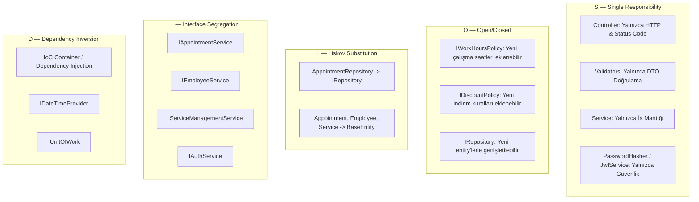

# Gün 12 — SOLID Code Review ve Refactoring

## 1. Genel Bakış ve Amaç

Projenin katmanlı mimarisi ve tüm backend modülleri, yazılım mühendisliğinin en temel prensipleri olan **SOLID** ilkeleri doğrultusunda kapsamlı bir kod incelemesinden (`Code Review`) geçirilmiş ve tespit edilen noktalar refactor edilmiştir.

---

## 2. SOLID Prensiplerinin Projedeki Gerçek Kullanımı



---

### 2.1. S — Single Responsibility Principle (Tek Sorumluluk Prensibi)
> *"Bir sınıfın değişmesi için yalnızca tek bir nedeni olmalıdır."*

#### Projedeki Uygulama:
1. **Controller'lar:** `AppointmentsController`, `EmployeesController` vb. yalnızca gelen HTTP isteklerini karşılama, parametreleri aktarma ve uygun HTTP status koduyla (`200`, `201`, `401`, `403`) yanıt dönme sorumluluğuna sahiptir. Veritabanı veya iş kuralı içermez.
2. **Global Exception Handling:** Hata yakalama ve JSON serileştirme sorumluluğu controller'lardan alınıp `GlobalExceptionMiddleware`'e devredilmiştir.
3. **Validasyon Sorumluluğu:** DTO sınıfları temiz tutulmuş; doğrulama kuralları bağımsız `FluentValidation` sınıflarına (`CreateAppointmentValidator`, `RegisterValidator` vb.) verilmiştir.
4. **Güvenlik Ayrımı:** Şifreleme (`PasswordHasher`), Token üretimi (`JwtTokenService`) ve Auth iş akışı (`AuthService`) 3 ayrı sınıfa bölünmüştür.

---

### 2.2. O — Open/Closed Principle (Açık / Kapalı Prensibi)
> *"Yazılım varlıkları geliştirmeye açık, fakat değişime kapalı olmalıdır."*

#### Projedeki Uygulama:
1. **Çalışma Saatleri Politikası (`IWorkHoursPolicy`):**
   - `AppointmentService` sınıfının kodunu değiştirmeden (`closed for modification`), haftasonu tarifesi, bayram tatili veya VIP şube çalışma saatleri gibi yeni politikalar (`WeekendWorkHoursPolicy`, `BranchWorkHoursPolicy`) sisteme DI üzerinden enjekte edilebilir (`open for extension`).
2. **İndirim / Fiyatlandırma Politikaları (`IDiscountPolicy`):**
   - `StudentDiscountPolicy`, `HappyHourDiscountPolicy`, `LoyaltyDiscountPolicy` gibi yeni indirim algoritmaları mevcut hesaplama motorunu değiştirmeden eklenebilir.
3. **Generic Repository (`IRepository<T>`):**
   - Çekirdek CRUD kodları değiştirilmeden yeni entity repository'leri eklenebilir.

---

### 2.3. L — Liskov Substitution Principle (Liskov Yerine Geçme Prensibi)
> *"Alt sınıflar, üst sınıfların yerine kullanılabilmeli ve programın doğruluğunu bozmamalıdır."*

#### Projedeki Uygulama:
1. **Repository Hiyerarşisi:** `AppointmentRepository`, `EmployeeRepository` ve `ServiceRepository`, temel `Repository<T>` ve `IRepository<T>` sözleşmesini (`GetByIdAsync`, `AddAsync`, `Update`, `Delete`) aynen korur; beklenen davranışı bozmaz veya `NotImplementedException` fırlatmaz.
2. **BaseEntity Polimorfizmi:** Tüm entity'ler (`Appointment`, `Employee`, `Service`, `User`) `BaseEntity` sınıfından türetilmiştir ve audit alanları (`Id`, `CreatedAt`, `IsActive`) tutarlı bir şekilde yönetilir.
3. **Standart Response:** `ApiResponse` türetildiği `ApiResponse<object>` temel sınıfının tüm sözleşmesini eksiksiz karşılar.

---

### 2.4. I — Interface Segregation Principle (Arayüz Ayrımı Prensibi)
> *"İstemciler, kullanmadıkları metotları içeren arayüzlere bağımlı olmaya zorlanmamalıdır."*

#### Projedeki Uygulama:
1. **Bölünmüş Servis Arayüzleri:** Bütün operasyonları içeren monolitik bir "IBarberService" yerine amaca yönelik odaklanmış arayüzler tasarlanmıştır:
   - `IAppointmentService`
   - `IEmployeeService`
   - `IServiceManagementService`
   - `IUserService`
   - `IAuthService`
   - `IPasswordHasher`
   - `IJwtTokenService`
   - `IDateTimeProvider`
2. **Controller İzolasyonu:** `ServicesController` yalnızca `IServiceManagementService` arayüzüne bağımlıdır; randevu veya auth metotlarını görmez.

---

### 2.5. D — Dependency Inversion Principle (Bağımlılıkların Tersine Çevrilmesi Prensibi)
> *"Yüksek seviyeli modüller, düşük seviyeli modüllere bağımlı olmamalıdır. Her ikisi de soyutlamalara bağımlı olmalıdır."*

#### Projedeki Uygulama:
1. **DbContext İzolasyonu:** Controller'lar veya Service katmanı somut `AppDbContext` veya SQL Server'a doğrudan bağımlı değildir; `IUnitOfWork` ve `IRepository` soyutlamaları üzerinden iletişim kurar.
2. **Zaman Bağımlılığı Soyutlaması (`IDateTimeProvider`):** `DateTime.UtcNow` çağrıları `IDateTimeProvider` arayüzü arkasına alınarak testlerde zamanın dondurulabilmesi (`mocking`) sağlanmıştır.
3. **IoC & Dependency Injection:** Tüm bağımlılıklar `Program.cs` ve `ServiceRegistration.cs` içerisinde `.NET Core Built-in IoC Container` aracılığıyla `Scoped` / `Singleton` olarak enjekte edilir.

---

## 3. Refactoring Öncesi ve Sonrası Karşılaştırma

| İnceleme Konusu | Refactoring Öncesi Durum | Refactoring Sonrası (SOLID) |
| :--- | :--- | :--- |
| **Controller Hata Yönetimi** | Her controller action'ında `try-catch` blokları vardı. | Merkezi `GlobalExceptionMiddleware` kuruldu, controller kodları %60 sadeleşti. |
| **Model Validasyonu** | Validasyonlar controller veya DTO içine gömülüydü. | `FluentValidation` ile bağımsız `AbstractValidator` sınıflarına ayrıldı. |
| **Çalışma Saatleri Kuralı** | `AppointmentService` içine sabit saatler kodlanmıştı. | `IWorkHoursPolicy` soyutlaması oluşturuldu (OCP). |
| **Zaman Bağımlılığı** | Doğrudan `DateTime.UtcNow` kullanılıyordu. | `IDateTimeProvider` ile test edilebilir hale getirildi (DIP). |
| **Güvenlik Sorumluluğu** | Karışık auth ve hash operasyonları tek yerdeydi. | `IPasswordHasher`, `IJwtTokenService`, `IAuthService` olarak ayrıştırıldı (SRP/ISP). |
| **Veritabanı Erişimi** | Potansiyel doğrudan context kullanımı riski vardı. | Tamamen `IUnitOfWork -> IRepository` katmanına hapsedildi. |

---

## 4. 5 SOLID Örnek Projesi (`BarberAppointment.SolidExamples`)

`samples/BarberAppointment.SolidExamples` konsol projesi 5 prensibin her birini izole senaryolarla göstermektedir:

```bash
dotnet run --project samples/BarberAppointment.SolidExamples
```

**Çıktı:**
```
=== S — Single Responsibility ===
Ali / Saç kesimi 11:00-11:30 tutar=250 TL

=== O — Open/Closed ===
Normal: 300 TL
Öğrenci: 270,0 TL
Happy hour: 240,0 TL

=== L — Liskov Substitution ===
Okuma (salt okunur sözleşme): 0 kayıt
Yazılabilir takvim: 1 kayıt

=== I — Interface Segregation ===
Liste: Ayşe — 10:00 sakal
Rapor: 1 randevu

=== D — Dependency Inversion ===
201 oluşturuldu
201 oluşturuldu
Toplam kayıt (servis üzerinden): 2
```
