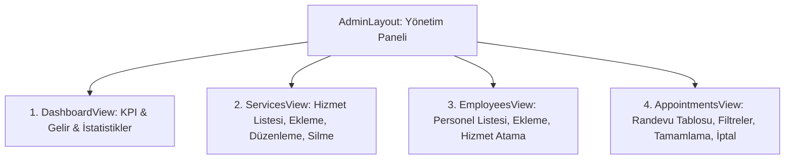

# Gün 15 — Web Yönetim Paneli ve CRUD Operasyonları

## 1. Genel Bakış ve Amaç

Kuaför Randevu Yönetim Sistemi için **Dashboard (Genel Bakış)**, **Hizmet Yönetimi (Services CRUD)**, **Personel Yönetimi (Employees CRUD)** ve **Randevu Yönetimi (Appointments)** ekranlarını içeren tam teşekküllü **Web Yönetim Paneli** geliştirilmiştir.

---

## 2. Araştırılan Konular ve Mimari Tasarım

### 2.1. React CRUD ve Modal Tasarım Deseni
- **Modüler Görünüm Ayrımı:** `AdminLayout` çatısı altında 4 bağımsız ekran (`DashboardView`, `ServicesView`, `EmployeesView`, `AppointmentsView`) tasarlanmıştır.
- **Form ve Modal Yönetimi:** Ekleme ve düzenleme işlemleri için ekranı kilitlemeyen, `backdrop-filter: blur(8px)` cam efektli dinamik modallar kullanılmıştır.
- **Canlı Arama ve Filtreleme:** İstemci tarafında anlık arama (Debounce gerekmeden hızlı string matching) ve personele/duruma göre çoklu filtreleme sağlanmıştır.

---

### 2.2. Yönetim Paneli Ekranları ve Özellikleri



---

### 2.3. Ekran Detayları

#### 1. Dashboard (Genel Bakış - [`DashboardView.jsx`](../src/presentation/BarberAppointment.Web/src/components/admin/DashboardView.jsx))
- **4 Adet KPI Kartı:**
  - 📅 **Toplam Randevu:** Sistemdeki toplam randevu sayısı ve aktif bekleyenler.
  - 💰 **Tahmini Ciro:** Onaylanmış ve tamamlanmış randevulardan elde edilen toplam gelir (₺).
  - 👥 **Aktif Personel:** Çalışan uzman kuaför sayısı.
  - ✂️ **Aktif Hizmetler:** Salonda sunulan bakım ve tıraş seçenekleri.
- **Son Randevular Akışı:** En son alınan randevuların müşteri adı, hizmet, personel, fiyat ve saat bilgisiyle canlı listesi.
- **Hızlı Kısayollar:** İlgili yönetim sekmelerine tek tıkla geçiş.

#### 2. Hizmetler (Services CRUD - [`ServicesView.jsx`](../src/presentation/BarberAppointment.Web/src/components/admin/ServicesView.jsx))
- Tablo üzerinde ID, Ad, Süre (dk), Fiyat (₺) ve Aktiflik durumu.
- Anlık isim bazlı arama çubuğu.
- **Yeni Hizmet Ekleme & Düzenleme Modalı:** Süre (5–300 dk) ve Fiyat (>0) validasyon kuralları.
- **Hizmet Silme:** Onay dialoguyla `DELETE /api/services/{id}` tetiklemesi.

#### 3. Personeller (Employees CRUD - [`EmployeesView.jsx`](../src/presentation/BarberAppointment.Web/src/components/admin/EmployeesView.jsx))
- Personel adı, unvanı, verebildiği hizmetlerin etiketleri (`badges`) ve durumu.
- **Hizmet Atama Yetkilendirme Modalı:** Salondaki tüm hizmetlerin çoklu seçim kutuları (`checkbox list`) ile personele tanımlanması (`POST /api/employees/{id}/services`).
- Personel ekleme, güncelleme ve silme operasyonları.

#### 4. Randevular (Appointments Management - [`AppointmentsView.jsx`](../src/presentation/BarberAppointment.Web/src/components/admin/AppointmentsView.jsx))
- Müşteri, personel, hizmet, tarih, saat aralığı ve durum sütunları.
- **Çok Kriterli Filtreleme:** Personele göre, Randevu Durumuna göre (`Bekliyor`, `Onaylandı`, `Tamamlandı`, `İptal Edildi`) veya serbest metin araması.
- **Hızlı Durum Eylemleri:**
  - `Tamamlandı Olarak İşaretle`: `PUT /api/appointments/{id}/complete`
  - `Randevuyu İptal Et`: `PUT /api/appointments/{id}/cancel`
- **Yeni Randevu Modalı:** Müşteri seçimi, personel, hizmet, tarih-saat seçimi ve özel notlar.

---

## 3. Bileşen ve Dosya Hiyerarşisi

```
src/presentation/BarberAppointment.Web/src/
├── api/
│   ├── client.js                (Axios Interceptor)
│   ├── authApi.js               (Auth API Metotları)
│   └── barberApi.js             (Services, Employees, Appointments, Users CRUD API)
├── components/
│   ├── admin/
│   │   ├── AdminLayout.jsx      (Yönetim Paneli Sekme Navigasyonu & Toast)
│   │   ├── DashboardView.jsx    (KPI Metrikleri, Gelir ve Son Randevular)
│   │   ├── ServicesView.jsx     (Hizmet CRUD Tablosu ve Modalı)
│   │   ├── EmployeesView.jsx    (Personel CRUD ve Hizmet Atama Modalı)
│   │   └── AppointmentsView.jsx (Randevu Yönetimi, Filtreleme, Tamamlama/İptal)
│   ├── Navbar.jsx               (Üst Menü ve Oturum Durumu)
│   ├── LoginScreen.jsx          (Giriş/Kayıt ve Demo Butonları)
│   └── DashboardScreen.jsx      (Müşteri Görünümü & JWT Token Inspector)
├── context/
│   └── AuthContext.jsx          (Oturum ve Rol Yönetimi)
├── index.css                    (Tasarım Sistemi)
└── App.jsx                      (Rol Bazlı Görünüm Yönlendirici)
```

---

## 4. Çalıştırma Talimatı

```bash
# 1. Backend API (Terminal 1)
dotnet run --project src/presentation/BarberAppointment.WebApi --launch-profile http
# http://localhost:5184/swagger

# 2. React Web Frontend (Terminal 2)
cd src/presentation/BarberAppointment.Web
npm run dev -- --port 3000
# http://localhost:3000
```
> **İpucu:** Yönetim panelini test etmek için giriş ekranında **"👑 Admin"** butonuna tıklayarak tek tıkla giriş yapabilirsiniz.
