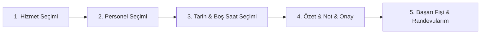

# Gün 17 — Mobil Randevu Akışı ve Sihirbaz Mimarisi

## 1. Genel Bakış ve Amaç

Kuaför Randevu Yönetim Sistemi için **React Native & Expo** mobil uygulamasında 4 adımlı **Mobil Randevu Alma Akışı (Wizard)** ve **Randevularım (My Appointments)** ekranı geliştirilmiş; mobilden backend REST API'ye gerçek randevu kaydı oluşturma ve iptal etme akışı tamamlanmıştır.

---

## 2. Araştırılan Konular ve Mobil Akış Mimarisi



### 2.1. Adım Adım Mobil Sihirbaz (Wizard Pattern)
- **Step 1 — Hizmet Seçimi:** API `/api/services` üzerinden çekilen aktif hizmetler; süre, ücret ve detay kartları halinde sunulur.
- **Step 2 — Personel Seçimi:** Seçilen hizmeti verebilen yetkili personeller `/api/employees/by-service/{serviceId}` üzerinden dinamik filtrelenir.
- **Step 3 — Tarih ve Saat Seçimi:**
  - Yatay kaydırılabilir 7 günlük tarih çiğleri (`Bugün`, `Yarın`, `Çar`, `Per` vb.).
  - Seçilen personel ve tarih için backend'in boş slot hesaplama motoru (`/api/appointments/available-slots`) tetiklenir; çakışmayan müsait saatler grid olarak sunulur.
- **Step 4 — Özet ve Onay:** Hizmet, personel, saat aralığı, toplam ücret ve opsiyonel not alanı ile teyit ekranı.
- **Step 5 — Başarı Kartı (Ticket Card):** Randevu ID'si, saat ve personel bilgileriyle konfeti tarzı tebrik ekranı.

---

### 2.2. Randevularım Ekranı ([`MyAppointmentsScreen.js`](../src/presentation/BarberAppointment.Mobile/src/screens/MyAppointmentsScreen.js))
- Giriş yapan kullanıcının (`user.id`) tüm randevuları `/api/appointments/user/{userId}` üzerinden listelenir.
- **Canlı Durum Rozetleri:**
  - `✓ Onaylandı` (Yeşil)
  - `⏱ Bekliyor` (Sarı/Amber)
  - `✓ Tamamlandı` (Mavi)
  - `✗ İptal Edildi` (Kırmızı)
- **Randevu İptal Eylemi:** Aktif randevular için onay uyarısı (`Alert.alert`) sonrasında `PUT /api/appointments/{id}/cancel` çağrılır ve slot serbest bırakılır.
- **Çekerek Yenileme (`Pull-to-Refresh`):** Liste aşağı kaydırılarak veriler tazelenir.

---

## 3. Eklenen ve Güncellenen Dosyalar

```
src/presentation/BarberAppointment.Mobile/
├── App.js                         (Alt Navigasyon Barı: Keşfet, Randevu Al, Randevularım)
└── src/
    ├── api/
    │   └── barberApi.js           (cancelAppointment & getEmployeesByService API)
    └── screens/
        ├── BookingScreen.js       (4 Adımlı Mobil Randevu Sihirbazı)
        ├── MyAppointmentsScreen.js (Randevu Geçmişi, Durum Rozetleri, İptal Eylemi)
        ├── HomeScreen.js          (Mobil Ana Sayfa)
        └── LoginScreen.js         (Giriş/Kayıt)
```

---

## 4. Çalıştırma Talimatları

### 1. Backend API (Terminal 1)
```bash
dotnet run --project src/presentation/BarberAppointment.WebApi --launch-profile http
# http://localhost:5184
```

### 2. React Native / Expo Mobil Uygulama (Terminal 2)
```bash
cd src/presentation/BarberAppointment.Mobile
npm start
```
- **iOS Simulator:** `i` tuşuna basın
- **Android Emulator:** `a` tuşuna basın
- **Web Önizleme:** `w` tuşuna basın
- **Fiziksel Telefon:** Expo Go ile terminaldeki QR kodu taratın.
