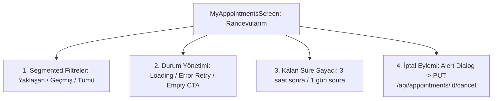

# Gün 18 — Mobil Randevularım, Listeleme ve İptal Yönetimi

## 1. Genel Bakış ve Amaç

Kuaför Randevu Yönetim Sistemi için **React Native & Expo** mobil uygulamasında **Aktif / Geçmiş Randevu Segmentasyonu**, **Loading, Error & Empty State** yönetimi, **Geri Sayım Sayacı (Countdown)**, **Randevu İptal Yeteneği** ve **Profil/Ayarlar Ekranı** geliştirilerek mobil temel fonksiyonlar başarıyla tamamlanmıştır.

---

## 2. Araştırılan Konular ve Mobil Mimari



---

### 2.1. Segmented Filtreleme ve Kategori Yönetimi
- 📌 **Yaklaşan Randevular (`upcoming`):** Gelecek tarihteki ve onaylanmış (`Confirmed`) veya bekleyen (`Pending`) randevular listelenir.
- 📜 **Geçmiş Randevular (`history`):** Tamamlanmış (`Completed`) veya İptal Edilmiş (`Cancelled`) randevular arşiv niteliğinde gösterilir.
- 🔍 **Tümü (`all`):** Kullanıcının tüm randevu geçmişi.

---

### 2.2. Loading, Error & Empty State Mimarisi
1. **Loading State:** API sorgusu sürerken altın renkli `ActivityIndicator` gösterilir.
2. **Error State:** Sunucu bağlantı hatasında veya API hatalarında kırmızı uyarı kutusu ve anında tetiklenebilen **"Yeniden Dene"** butonu sunulur.
3. **Empty State:** Kullanıcının hiç randevusu yoksa veya filtrede kayıt bulunamadıysa motive edici **"+ Hemen Randevu Al"** eylem kartı çıkar.

---

### 2.3. Kalan Süre ve Dinamik Geri Sayım (`getRelativeTime`)
Randevu saatine kalan süre anlık hesaplanarak kullanıcıya iletilir:
$$\Delta t = \text{Randevu Başlangıç Zamanı} - \text{Şu An}$$
- $\Delta t > 24 \text{ saat} \longrightarrow \text{"⏳ X gün sonra"}$
- $1 \text{ saat} < \Delta t \le 24 \text{ saat} \longrightarrow \text{"⏳ X saat sonra"}$
- $\Delta t \le 1 \text{ saat} \longrightarrow \text{"⏳ X dakika sonra"}$

---

### 2.4. Güvenli Randevu İptal Eylemi
- Yalnızca aktif ve gelecek tarihli randevularda **"Randevuyu İptal Et"** butonu aktif olur.
- Native `Alert.alert` onay penceresi açılır; kullanıcı onaylarsa backend API'ye `PUT /api/appointments/{id}/cancel` isteği gönderilir ve slot sistemde anında serbest kalır.

---

## 3. Ekranlar ve 4 Sekmeli Mobil Navigasyon

| Sekme | İkon | Bileşen | Sorumluluk |
| :--- | :---: | :--- | :--- |
| **Keşfet** | 🏠 | [`HomeScreen.js`](../src/presentation/BarberAppointment.Mobile/src/screens/HomeScreen.js) | Salon özeti, aktif hizmetler, uzman kuaför kadrosu ve API durumu |
| **Randevu Al** | ✂️ | [`BookingScreen.js`](../src/presentation/BarberAppointment.Mobile/src/screens/BookingScreen.js) | 4 adımlı randevu alma sihirbazı (Hizmet -> Personel -> Tarih/Slot -> Onay) |
| **Randevularım** | 📅 | [`MyAppointmentsScreen.js`](../src/presentation/BarberAppointment.Mobile/src/screens/MyAppointmentsScreen.js) | Segmented randevu listesi, sayaç rozeti, iptal yönetimi |
| **Profilim** | 👤 | [`ProfileScreen.js`](../src/presentation/BarberAppointment.Mobile/src/screens/ProfileScreen.js) | Hesap bilgileri, JWT token inceleme, dinamik API URL ayarı, çıkış |

---

## 4. Çalıştırma Talimatları

```bash
# 1. Backend API (Terminal 1)
dotnet run --project src/presentation/BarberAppointment.WebApi --launch-profile http
# http://localhost:5184

# 2. React Native / Expo Mobil Uygulama (Terminal 2)
cd src/presentation/BarberAppointment.Mobile
npm start
# iOS: 'i', Android: 'a', Web: 'w'
```
