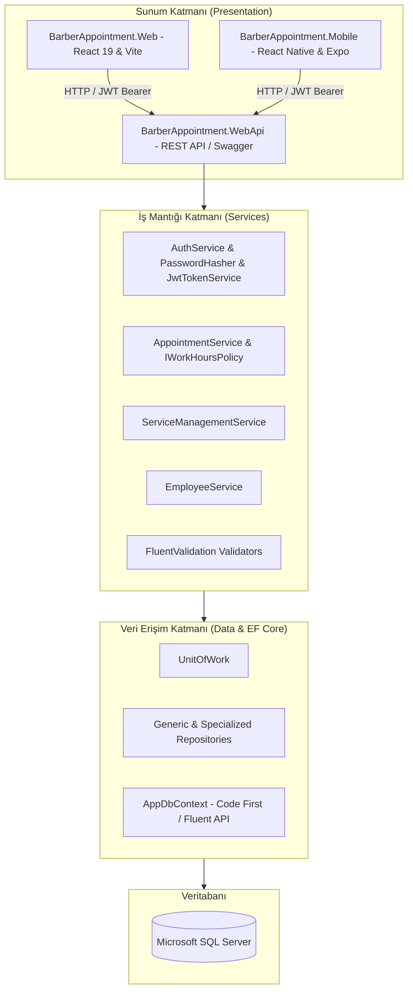

# Gün 19 — Genel Test, Bug Fix, Git ve Proje Tamamlama

## 1. Genel Bakış ve Amaç

Kuaför Randevu Yönetim Sistemi projesi; **Backend (ASP.NET Core 10 Web API)**, **Web Frontend (React 19 & Vite)** ve **Mobil Uygulama (React Native & Expo)** bileşenleriyle uçtan uca test edilmiş, tüm iş kuralları ve güvenlik mekanizmaları doğrulanarak **Sunuma Hazır** hale getirilmiştir.

---

## 2. Uçtan Uca Test Sonuçları Özeti

| Test Kategorisi | Kapsam | Araç / Yöntem | Sonuç |
| :--- | :--- | :--- | :---: |
| **API E2E Tests** | 22 Adet Senaryo (Auth, CRUD, Çakışma, 401, 403, 400, 404, 409) | `tests/test_all_scenarios.sh` | ✅ 22/22 PASS |
| **SOLID İlkeleri** | S, O, L, I, D Prensiplerinin Konsol Gösterimi | `samples/BarberAppointment.SolidExamples` | ✅ 5/5 PASS |
| **Web Frontend Build** | React 19, Axios, Lucide Icons, Vite Bundle | `npm run build` | ✅ 0 Error / 0 Warning |
| **Mobil Bundle Export** | Expo SDK 57, iOS / Android Metro Bundler | `npx expo export` | ✅ 0 Error / 0 Warning |
| **Veritabanı Bütünlüğü** | SQL Server DDL, Seed Data, Foreign Keys & Constraints | MS SQL Server Docker Container | ✅ Doğrulandı |

---

## 3. Mimari Bileşenler ve Tamamlanan Modüller

---

## 4. 19 Günlük Geliştirme Yol Haritası ve Tamamlanan Çıktılar

| Gün | Konu & Başlık | Çıktı / Doküman |
| :---: | :--- | :--- |
| **Gün 1** | Gereksinim Analizi & SQL Tablo Tasarımı | [Gun1-Gereksinim-Analizi.md](Gun1-Gereksinim-Analizi.md) |
| **Gün 2** | Entity Framework Core & DbContext Yapılandırması | [Gun2-EFCore-ve-DbContext.md](Gun2-EFCore-ve-DbContext.md) |
| **Gün 3** | Generic Repository & Unit of Work Deseni | [Gun3-Repository-ve-UnitOfWork.md](Gun3-Repository-ve-UnitOfWork.md) |
| **Gün 4** | Özel Repository'ler & DTO Tasarımı | [Gun4-Ozel-Repositoryler-ve-DTOs.md](Gun4-Ozel-Repositoryler-ve-DTOs.md) |
| **Gün 5** | Service Katmanı & Hizmet Yönetimi İş Kuralları | [Gun5-Hizmet-Yonetimi-Business-Logic.md](Gun5-Hizmet-Yonetimi-Business-Logic.md) |
| **Gün 6** | Personel Yönetimi Servisleri | [Gun6-Personel-Yonetimi.md](Gun6-Personel-Yonetimi.md) |
| **Gün 7** | REST API & Swagger UI Başlangıç | [Gun7-REST-API-ve-Swagger-UI.md](Gun7-REST-API-ve-Swagger-UI.md) |
| **Gün 8** | Full CRUD REST Controller'lar | [Gun8-Full-CRUD-REST-APIs.md](Gun8-Full-CRUD-REST-APIs.md) |
| **Gün 9** | Randevu Modülü & Çakışma Önleme Kuralları | [Gun9-Randevu-Modulu-Business-Rules.md](Gun9-Randevu-Modulu-Business-Rules.md) |
| **Gün 10** | FluentValidation & Global Exception Handling | [Gun10-Validation-ve-Exception-Handling.md](Gun10-Validation-ve-Exception-Handling.md) |
| **Gün 11** | HMAC-SHA512 Şifreleme & Stateless JWT Authentication | [Gun11-Authentication-ve-JWT.md](Gun11-Authentication-ve-JWT.md) |
| **Gün 12** | SOLID Code Review & Refactoring | [Gun12-SOLID-Code-Review-ve-Refactoring.md](Gun12-SOLID-Code-Review-ve-Refactoring.md) |
| **Gün 13** | Postman Collection & 22 Adımlı E2E Test Paketi | [Gun13-Backend-Test-ve-Tamamlama.md](Gun13-Backend-Test-ve-Tamamlama.md) |
| **Gün 14** | React 19 Web Başlangıç & JWT Entegrasyonu | [Gun14-React-Web-Baslangic.md](Gun14-React-Web-Baslangic.md) |
| **Gün 15** | Web Yönetim Paneli (Dashboard, Services, Staff, Appt CRUD) | [Gun15-Web-Yonetim-Paneli.md](Gun15-Web-Yonetim-Paneli.md) |
| **Gün 16** | React Native / Expo Mobil Başlangıç & API Bağlantısı | [Gun16-React-Native-Expo-Baslangic.md](Gun16-React-Native-Expo-Baslangic.md) |
| **Gün 17** | Mobil Randevu Sihirbazı (4-Step Wizard & Boş Slotlar) | [Gun17-Mobil-Randevu-Akisi.md](Gun17-Mobil-Randevu-Akisi.md) |
| **Gün 18** | Mobil Randevularım (Segmented, Countdown, İptal, Profil) | [Gun18-Mobil-Randevularim.md](Gun18-Mobil-Randevularim.md) |
| **Gün 19** | Genel Test, Bug Fix, Git & Sunum Dokümantasyonu | [Gun19-Genel-Test-BugFix-Git-README.md](Gun19-Genel-Test-BugFix-Git-README.md) |

---

## 5. Sunum ve Canlı Demo Rehberi

1. **Backend Başlatma:** `dotnet run --project src/presentation/BarberAppointment.WebApi --launch-profile http` (Swagger: `http://localhost:5184/swagger`)
2. **Web Paneli Başlatma:** `cd src/presentation/BarberAppointment.Web && npm run dev -- --port 3000` (`http://localhost:3000`)
3. **Mobil Uygulamayı Başlatma:** `cd src/presentation/BarberAppointment.Mobile && npm start`
4. **Hızlı Demo Girişleri:**
   - 👑 **Admin:** `superadmin@example.com` / `AdminPassword123!`
   - ✂️ **Personel:** `ali@example.com` / `Password123!`
   - 👤 **Müşteri:** `burak@example.com` / `Password123!`
