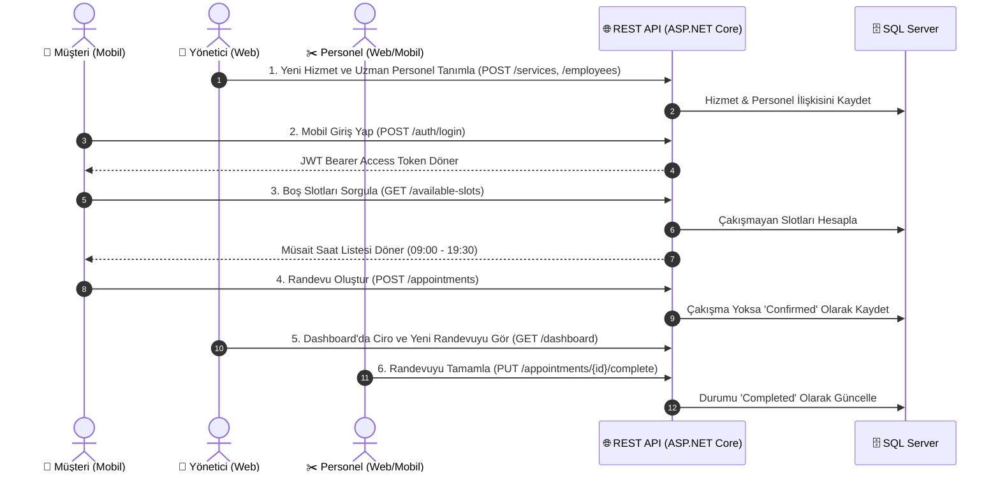

# Gün 20 — Proje Sunumu ve Kapsamlı Teknik Değerlendirme (Final Demo)

## 1. Giriş ve Proje Özeti

**Kuaför Randevu Yönetim Sistemi (BarberAppointment)**; kuaför salonları, çalışan personeller ve müşteriler arasındaki randevu, katalog ve personel yönetim süreçlerini uçtan uca dijitalleştiren; **Kurumsal Katmanlı Mimari (.NET 10)**, **Web Yönetim Paneli (React 19 & Vite)** ve **Mobil Uygulama (React Native & Expo)** bileşenlerinden oluşan tam yığın (Full-Stack) bir çözümdür.

---

## 2. Uçtan Uca Final Demo Akışı



---

## 3. Teknik Değerlendirme ve Mülakat Soru-Cevap Rehberi

### Soru 1: Katmanlı Mimari (N-Tier Architecture) Neden Tercih Edildi? Katmanlar Arasındaki Bağımlılık Yönü Nasıldır?
**Cevap:**
- **Sorumlulukların Ayrılması (SoC - Separation of Concerns):** Veritabanı erişimi, iş kuralları ve sunum katmanları birbirine sıkı sıkıya bağlanmadan bağımsız olarak geliştirilebilir ve test edilebilir.
- **Bağımlılık Yönü (Dependency Rule):**
  - `Core & Domain` en içteki çekirdektir; harici hiçbir katmana bağımlı değildir.
  - `Data` ve `Services` katmanları `Domain` ve `Core`'a bağımlıdır.
  - `WebApi` (Presentation) üst seviye orkestratördür ve `Services` ile `Data` katmanlarını Dependency Injection ile birleştirir.
- **Değiştirilebilirlik:** Gelecekte SQL Server yerine PostgreSQL'e geçilmek istendiğinde yalnızca `Data` katmanında değişiklik yapılması yeterlidir; `Services` ve `WebApi` katmanları bundan etkilenmez.

---

### Soru 2: SOLID İlkeleri Projede Somut Olarak Nasıl Uygulandı?
**Cevap:**
- **S (Single Responsibility):** 
  - [`PasswordHasher.cs`](../src/libraries/BarberAppointment.Services/Security/PasswordHasher.cs) yalnızca HMAC-SHA512 şifreleme ve doğrulama yapar.
  - [`JwtTokenService.cs`](../src/libraries/BarberAppointment.Services/Security/JwtTokenService.cs) yalnızca Token üretir.
- **O (Open/Closed):** 
  - [`IWorkHoursPolicy.cs`](../src/libraries/BarberAppointment.Services/Policies/IWorkHoursPolicy.cs) arayüzü sayesinde çalışma saatleri (09:00-20:00) veya tatil günleri politikası `StandardWorkHoursPolicy` içine kapsüllenmiştir. İleride VIP salonlar veya pazar açık şubeler için yeni bir policy yazılıp sisteme kod değiştirmeden enjekte edilebilir.
- **L (Liskov Substitution):** 
  - `Repository<T>` ve `IReadOnlyRepository<T>` sözleşmeleri alt sınıflar tarafından davranış bozulmadan yerine geçebilir.
- **I (Interface Segregation):** 
  - Şişkin tek bir devasa interface yerine `IAppointmentService`, `IServiceManagementService`, `IEmployeeService`, `IAuthService` gibi odaklı ve parçalı sözleşmeler tanımlanmıştır.
- **D (Dependency Inversion):** 
  - `AppointmentService`, `DateTime.Now` yerine [`IDateTimeProvider`](../src/libraries/BarberAppointment.Core/Time/IDateTimeProvider.cs) soyutlamasına; doğrudan `DbContext` yerine [`IUnitOfWork`](../src/libraries/BarberAppointment.Data/UnitOfWork/IUnitOfWork.cs)'e bağımlıdır. Bu sayede birim testlerde sistem saati ve veritabanı kolayca taklit (`mock`) edilebilir.

---

### Soru 3: Dependency Injection (DI) ve Servis Yaşam Döngüleri (Lifetimes) Nasıl Kurgulandı?
**Cevap:**
- **Scoped:** `IUnitOfWork`, `AppDbContext`, `IAppointmentService`, `IAuthService` gibi veri tabanı oturumu ve iş servisleri için kullanılmıştır. HTTP isteği başladığında üretilir, istek bittiğinde otomatik `Dispose` edilir.
- **Singleton:** `IDateTimeProvider` ve `IWorkHoursPolicy` gibi durum (`state`) tutmayan, uygulama boyunca tek bir örneği yeten servislerde kullanılmıştır.
- **Loose Coupling:** Sınıflar somut `new` anahtar kelimesiyle nesne oluşturmaz; bağımlılıklar yapıcı metot (`Constructor Injection`) üzerinden dışarıdan verilir.

---

### Soru 4: Entity Framework Core Varken Neden Repository & Unit of Work Deseni Kullanıldı?
**Cevap:**
1. **İş Mantığının ORM Bağımsızlığı:** EF Core'a ait `IQueryable` veya `DbContext` sızıntısını iş katmanına (`Services`) taşımamak için soyutlama sağlandı.
2. **Merkezi Sorgu Mantığı:** Örneğin bir personelin aktifliğini, silinmemişliğini (`IsDeleted == false`) veya ilişkili tabloların `Include` edilmesini özelleşmiş `AppointmentRepository` içinde tek noktada yönetmek.
3. **Atomik Transaction Yönetimi:** Birden fazla tablonun güncellendiği senaryolarda `UnitOfWork.SaveChangesAsync()` ile tüm işlemler tek bir SQL Transaction altında çalıştırılarak veri tutarlılığı (`ACID`) garanti edilir.

---

### Soru 5: Neden Doğrudan Entity Yerine DTO (Data Transfer Object) Kullanıldı?
**Cevap:**
- **Güvenlik (Over-Posting Önleme):** Kullanıcının API'ye fazladan alan (örn: `Role = Admin` veya `IsActive = true`) göndererek veritabanında yetkisiz güncelleme yapması engellenir.
- **Performans:** Yalnızca istemcinin ihtiyaç duyduğu alanlar taşınır (`Network Payload` küçülür).
- **Döngüsel Referans Önleme (Circular Reference):** `Employee -> Appointment -> Employee` gibi EF Core ilişkilerinin JSON serileştirmede sonsuz döngüye girmesi engellenir.

---

### Soru 6: Kimlik Doğrulama ve Yetkilendirme (JWT & HMAC-SHA512) Mimarisi Nasıl Çalışır?
**Cevap:**
- **Şifre Güvenliği:** Kullanıcı şifreleri asla düz metin (`plain text`) saklanmaz. 128-byte rastgele `Salt` üretilerek `HMAC-SHA512` ile hash'lenir ve `PasswordHash` + `PasswordSalt` olarak veritabanına yazılır.
- **Stateless JWT Bearer:** Sunucu oturum (`session`) tutmaz; kullanıcının kimliği ve rolü (`Role.Admin`, `Role.Employee`, `Role.Customer`) JWT Payload içindeki Claim'lerde taşınır.
- **Role-Based Access Control (RBAC):** Controller endpointleri `[Authorize(Roles = "Admin")]` gibi niteliklerle korunur.
- **İstemci Entegrasyonu:** Hem React Web hem React Native uygulamalarında Axios Request Interceptor ile her HTTP isteğinin başlığına otomatik olarak `Authorization: Bearer <token>` eklenir.

---

### Soru 7: Randevu Çakışma Önleme ve İş Kuralları Nasıl Çözüldü?
**Cevap:**
1. **Zaman Aralığı Çakışma Algoritması:**
   Aynı personelin var olan randevusu ($S_{exist}, E_{exist}$) ile yeni randevu ($S_{new}, E_{new}$) arasında şu matematiksel çakışma denetimi yapılır:
   $$\text{Çakışma Var} \iff S_{new} < E_{exist} \land E_{new} > S_{exist}$$
2. **Mesai Saatleri ve Tatil:**
   - Randevunun başlangıç ve bitiş saati 09:00 - 20:00 arasında olmalıdır.
   - Pazar günleri salon kapalıdır.
   - Geçmiş tarihe randevu alınamaz ($S_{new} \le \text{DateTime.UtcNow}$).
3. **Yetki ve Beceri Eşleşmesi:**
   - Personel aktif olmalı ve talep edilen hizmeti verebilme yetkisine sahip olmalıdır.

---

### Soru 8: Global Hata Yönetimi ve Validasyon Mimarisi Nasıl İşler?
**Cevap:**
- **FluentValidation:** Request DTO'ları controller'a ulaşmadan önce doğrulanır.
- **GlobalExceptionMiddleware:** Controller seviyesinde try-catch kalabalığı oluşturmadan, sistemde fırlatılan tüm istisnaları (`ValidationException`, `KeyNotFoundException`, `InvalidOperationException`) yakalar; HTTP durum kodunu ayarlar ve standart `ApiResponse<T>` formatında istemciye döner.

---

## 4. Sistem Gereksinimleri ve Başlatma Komutları

```bash
# 1. SQL Server Container (Zaten Çalışıyor)
# Server: localhost,1433 | User: sa | Password: BarberApp_Dev1!

# 2. Backend REST API & Swagger (Terminal 1)
dotnet run --project src/presentation/BarberAppointment.WebApi --launch-profile http
# http://localhost:5184/swagger

# 3. React 19 Web Yönetim Paneli (Terminal 2)
cd src/presentation/BarberAppointment.Web
npm run dev -- --port 3000
# http://localhost:3000

# 4. React Native & Expo Mobil Uygulama (Terminal 3)
cd src/presentation/BarberAppointment.Mobile
npm start
# iOS Simulator için: 'i' | Android Emulator için: 'a' | Web Önizleme için: 'w'
```

---

## 5. Proje İstatistikleri ve Başarı Tablosu

- 🚀 **Tamamlanan Gün Sayısı:** 20 / 20 Gün (%100 Başarı)
- 🧪 **Otomatik Uçtan Uca Testler:** 22 / 22 Başarılı (%100 Başarı)
- 📐 **SOLID Prensipleri:** 5 / 5 Konsol Uygulaması ile Kanıtlandı
- 💻 **Web Frontend:** React 19 + Vite Dark Theme Yönetim Paneli (0 Hata)
- 📱 **Mobil Uygulama:** React Native & Expo 4 Adımlı Randevu Sihirbazı (0 Hata)
- 🗄️ **Veritabanı:** MS SQL Server + Entity Framework Core Code First
