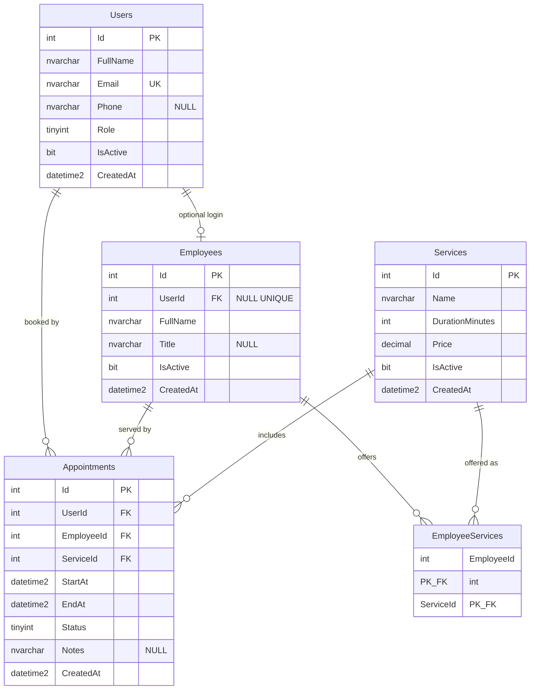

# BarberAppointment — Gün 3: Veritabanı Tasarımı

**Kapsam:** PK/FK, 1-N, normalizasyon, index, JOIN, NULL/NOT NULL; `Users`, `Employees`, `Services`, `Appointments` tabloları; ER diyagramı; MSSQL script’leri.

Script’ler: `database/mssql/`

Mac’te SQL Server yoksa: [MSSQL yerel kurulum (Docker)](./Gun3-MSSQL-Yerel-Kurulum.md)

```bash
chmod +x database/mssql/up.sh
./database/mssql/up.sh
```

Windows / mevcut SQL Server:

```bash
# SQL Server’da (sqlcmd örneği)
sqlcmd -S localhost -E -i database/mssql/01_create_database.sql
sqlcmd -S localhost -E -d BarberAppointment -i database/mssql/02_schema.sql
sqlcmd -S localhost -E -d BarberAppointment -i database/mssql/03_seed.sql
sqlcmd -S localhost -E -d BarberAppointment -i database/mssql/04_sample_joins.sql
```

---

## 1. Araştırma notları

### 1.1 Primary key (PK)

Tablodaki satırı **tekil** tanımlayan sütun (veya sütun grubu). Bu şemada tüm ana varlıklar `Id INT IDENTITY` surrogat anahtar kullanır: iş alanı değişse bile referanslar kırılmaz.

### 1.2 Foreign key (FK)

Başka tablonun PK’sine işaret eder; referans bütünlüğünü korur. `Appointments.EmployeeId` → `Employees.Id`: var olmayan ustaya randevu yazılamaz.

`ON DELETE` politikası MVP’de **NO ACTION / RESTRICT**: randevusu olan personel/hizmet silinmez; `IsActive = 0` ile pasife alınır (Day 1).

### 1.3 One-to-many (1-N)

Bir satır, diğer tabloda birçok satıra karşılık gelir.

| İlişki | Anlam |
| :--- | :--- |
| `Users` 1 — N `Appointments` | Bir müşterinin birden fazla randevusu |
| `Employees` 1 — N `Appointments` | Bir ustanın birden fazla randevusu |
| `Services` 1 — N `Appointments` | Aynı hizmet birçok randevuda |

### 1.4 Many-to-many (N-N) — `EmployeeServices`

Gün 3 dört ana tablo ister; FR-P02 “personel birden fazla hizmet verebilir” için **ara tablo** gerekir. Hizmet listesini `Employees` içine CSV yazmak 1NF’i bozar.

`EmployeeServices (EmployeeId, ServiceId)` bileşik PK: bir usta-hizmet çifti bir kez.

### 1.5 Normalizasyon

| Form | Bu şemada |
| :--- | :--- |
| 1NF | Tek değerli sütunlar; tekrarlayan “hizmet1, hizmet2” yok |
| 2NF | Ara tabloda fiyat yok; fiyat `Services`’te (sadece `ServiceId`’ye bağlı) |
| 3NF | `Appointments` içinde müşteri adı/e-posta yok; `UserId` ile bulunur |

`EndAt` hizmet süresinden türetilebilir; sorgularda JOIN + hesap yerine saklanır. Bu bilinçli denormalizasyon (performans / çakışma sorgusu); kaynak doğruluk `DurationMinutes` ile uygulama katmanında korunur.

### 1.6 Index

Index, WHERE/JOIN/ORDER BY kolonlarında tarama yerine arama sağlar; yazmayı biraz yavaşlatır.

| Index | Gerekçe |
| :--- | :--- |
| `Users.Email` UNIQUE | FR-K01, login/arama |
| `Employees.UserId` filtrelenmiş UNIQUE | Giriş hesabı varsa tek personel; birden fazla `NULL` serbest (SQL Server klasik UNIQUE tek NULL kabul eder) |
| `Appointments (EmployeeId, StartAt)` | Usta takvimi, çakışma sorgusu |
| `Appointments (UserId, StartAt)` | Müşteri randevu listesi |
| `EmployeeServices (ServiceId)` | “Bu hizmeti kim veriyor?” |

Çakışmayı (örtüşen aralık) tek UNIQUE ile çözmek SQL Server’da aralık tipi olmadan zordur; uygulama + index’li sorgu (Day 1 FR-R03).

### 1.7 JOIN

İlişkili satırları birleştirir. Örnekler `04_sample_joins.sql` içinde: randevu + müşteri + usta + hizmet (`INNER JOIN`); hizmeti henüz vermeyen usta (`LEFT JOIN`).

### 1.8 NULL / NOT NULL

- **NOT NULL:** kimlik, rol, randevu zamanı, fiyat, süre — kayıtsız iş kuralı olmaz.
- **NULL:** `Users.Phone`, `Employees.Title`, `Appointments.Notes`, `Employees.UserId` (giriş hesabı henüz yoksa).

`NULL` “bilinmiyor / yok”; `0` veya `''` ile karıştırılmamalı.

---

## 2. Tablo tasarımı

### Users

| Sütun | Tip | Kısıt |
| :--- | :--- | :--- |
| Id | INT | PK, IDENTITY |
| FullName | NVARCHAR(100) | NOT NULL |
| Email | NVARCHAR(256) | NOT NULL, UNIQUE |
| Phone | NVARCHAR(20) | NULL |
| Role | TINYINT | NOT NULL, CHECK (1=Customer, 2=Admin, 3=Staff) |
| IsActive | BIT | NOT NULL, DEFAULT 1 |
| CreatedAt | DATETIME2(0) | NOT NULL |

### Employees

| Sütun | Tip | Kısıt |
| :--- | :--- | :--- |
| Id | INT | PK, IDENTITY |
| UserId | INT | NULL, FK → Users, UNIQUE (bir hesap = bir personel) |
| FullName | NVARCHAR(100) | NOT NULL |
| Title | NVARCHAR(100) | NULL |
| IsActive | BIT | NOT NULL, DEFAULT 1 |
| CreatedAt | DATETIME2(0) | NOT NULL |

### Services

| Sütun | Tip | Kısıt |
| :--- | :--- | :--- |
| Id | INT | PK, IDENTITY |
| Name | NVARCHAR(100) | NOT NULL |
| DurationMinutes | INT | NOT NULL, CHECK > 0 |
| Price | DECIMAL(10,2) | NOT NULL, CHECK >= 0 |
| IsActive | BIT | NOT NULL, DEFAULT 1 |
| CreatedAt | DATETIME2(0) | NOT NULL |

### Appointments

| Sütun | Tip | Kısıt |
| :--- | :--- | :--- |
| Id | INT | PK, IDENTITY |
| UserId | INT | NOT NULL, FK → Users |
| EmployeeId | INT | NOT NULL, FK → Employees |
| ServiceId | INT | NOT NULL, FK → Services |
| StartAt | DATETIME2(0) | NOT NULL |
| EndAt | DATETIME2(0) | NOT NULL, CHECK > StartAt |
| Status | TINYINT | NOT NULL, CHECK (1=Pending … 4=Cancelled) |
| Notes | NVARCHAR(500) | NULL |
| CreatedAt | DATETIME2(0) | NOT NULL |

Durum: `1 Pending`, `2 Confirmed`, `3 Completed`, `4 Cancelled`.

### EmployeeServices (ilişki tablosu)

| Sütun | Tip | Kısıt |
| :--- | :--- | :--- |
| EmployeeId | INT | PK, FK → Employees |
| ServiceId | INT | PK, FK → Services |

---

## 3. ER diyagramı



Aynı diyagram: [er-diagram.mmd](./er-diagram.mmd) (Mermaid önizleme / mermaid.live).

---

## 4. Gün 3 çıktısı

| Çıktı | Konum |
| :--- | :--- |
| Tasarım + kavramlar + ER | Bu dosya |
| Mermaid kaynak | `docs/er-diagram.mmd` |
| Veritabanı oluşturma | `database/mssql/01_create_database.sql` |
| Tablolar, FK, index | `database/mssql/02_schema.sql` |
| Örnek veri | `database/mssql/03_seed.sql` |
| JOIN örnekleri | `database/mssql/04_sample_joins.sql` |
