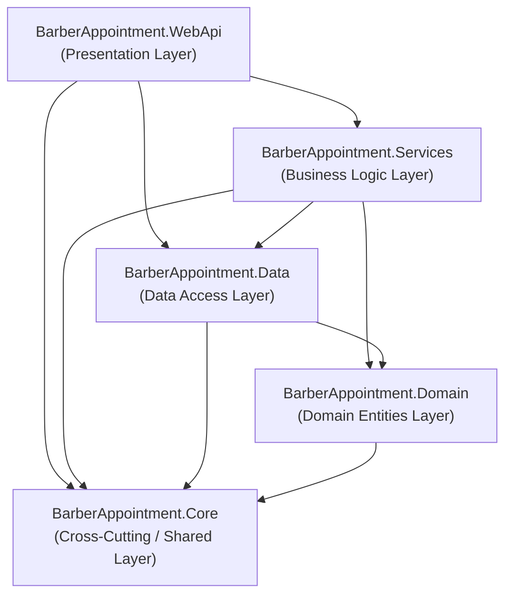

# BarberAppointment — Gün 4: .NET Solution ve Katmanlı Mimari

**Kapsam:** Solution, Project, Class Library, Project Reference, Separation of Concerns (SoC); `Core`, `Domain`, `Data`, `Services`, `WebApi` projelerinin oluşturulması ve bağımlılıklarının yapılandırılması.

---

## 1. Araştırılacak Temel Konular

### 1.1 Solution (.sln) Nedir?
- **Tanım:** Solution, birbiriyle ilişkili bir veya birden fazla .NET projesini (`.csproj`) tek bir çatı altında toplayan, projeler arası derleme sırasını ve konfigürasyonları yöneten konteyner bir dosyadır.
- **Rolü:** Visual Studio, VS Code veya `dotnet CLI` araçlarının tüm sistemi tek seferde derlemesini (`dotnet build`), test etmesini (`dotnet test`) veya çalıştırmasını sağlar.
- **Kullanım:**
  ```bash
  dotnet new sln -n BarberAppointment
  dotnet sln add <proje_yolu.csproj>
  ```

### 1.2 Project (.csproj) Nedir?
- **Tanım:** C# kaynak kodlarının nasıl derleneceğini, hangi .NET sürümünü hedeflediğini (`TargetFramework`), hangi NuGet paketlerine ve diğer projelere bağımlı olduğunu belirten XML tabanlı MSBuild yapılandırma dosyasıdır.
- **Özellikler:**
  - `TargetFramework`: `net10.0`
  - `Nullable`: `enable` (Null referans güvenliği)
  - `ImplicitUsings`: `enable` (Sık kullanılan namespace'lerin otomatik dahil edilmesi)

### 1.3 Class Library (Sınıf Kitaplığı) Nedir?
- **Tanım:** Doğrudan çalıştırılabilir (`exe` / giriş noktası `Main` metodu) olmayan, derlendiğinde `.dll` (Dynamic Link Library) çıktısı üreten ve diğer uygulamalar tarafından tekrar kullanılabilir kod kütüphanesidir.
- **Katmanlı Mimarideki Yeri:** `Core`, `Domain`, `Data` ve `Services` katmanlarının her biri birer Class Library'dir. Yalnızca `WebApi` çalıştırılabilir (executable) projedir.

### 1.4 Project Reference (Proje Başvuruları) Nedir?
- **Tanım:** Bir projenin başka bir projedeki tip ve sınıfları kullanabilmesi için aralarında kurulan derleme zamanı referans ilişkisidir.
- **Önemi:** Katmanlı mimaride "doğru bağımlılık yönü" (Dependency Flow) kurularak dairesel bağımlılıklar (Circular Dependency) engellenir.
- **Kullanım:**
  ```bash
  dotnet add <hedef_proje.csproj> reference <kaynak_proje.csproj>
  ```

### 1.5 Separation of Concerns (İlgi Alanlarının Ayrımı - SoC)
- **Tanım:** Bir yazılım sisteminin her bir parçasının yalnızca kendine ait tek bir sorumluluğa ve ilgi alanına sahip olması ilkesidir.
- **Faydaları:**
  - **Bakım Kolaylığı:** Veritabanı veya ORM değiştiğinde iş mantığı (Services) veya API controller'ları etkilenmez.
  - **Test Edilebilirlik:** İş kuralları veritabanından veya HTTP bağlamından izole şekilde birim testlere (Unit Test) tabi tutulabilir.
  - **Spagetti Kodun Engellenmesi:** Controller içerisinde SQL sorgusu veya entity içinde HTTP yanıt kodu yazılması engellenir.

---

## 2. Katmanlı Mimari Sorumlulukları ve Bağımlılık Haritası

```
BarberAppointment/
├── BarberAppointment.sln
├── src/
│   ├── libraries/
│   │   ├── BarberAppointment.Core/       # Ortak enum'lar, hata tipleri, Result modelleri
│   │   ├── BarberAppointment.Domain/     # Entity'ler, domain modelleri
│   │   ├── BarberAppointment.Data/       # EF Core DbContext, Repository arayüz & implementasyonları
│   │   └── BarberAppointment.Services/   # İş kuralları, DTO'lar, Service arayüz & implementasyonları
│   └── presentation/
│       └── BarberAppointment.WebApi/     # Controllers, Program.cs, Middleware, Swagger
└── samples/
    └── BarberAppointment.SolidExamples/ # Gün 2 SOLID örnekleri
```

### 2.1 Katman Sorumluluk Tablosu

| Katman | Proje Tipi | Referans Aldığı Projeler | Temel Sorumluluğu |
| :--- | :--- | :--- | :--- |
| **BarberAppointment.Core** | Class Library | *(Hiçbiri - Bağımsız)* | Standart API yanıtları (`ApiResponse<T>`), ortak istisnalar (`NotFoundException`, `ConflictException`), ortak enum'lar (`UserRole`, `AppointmentStatus`). |
| **BarberAppointment.Domain** | Class Library | `Core` | Veritabanı tablolarına karşılık gelen saf varlıklar (`User`, `Employee`, `Service`, `Appointment`, `EmployeeService`). |
| **BarberAppointment.Data** | Class Library | `Domain`, `Core` | Veri erişim katmanı. EF Core konfigürasyonları, `DbContext`, Migration'lar, Repository implementasyonları (`IRepository<T>`). |
| **BarberAppointment.Services** | Class Library | `Domain`, `Data`, `Core` | İş mantığı katmanı. Validasyonlar, DTO'lar (`AppointmentDto`), çakışma kontrolleri, Service arayüz ve sınıfları (`IAppointmentService`). |
| **BarberAppointment.WebApi** | Web API (ASP.NET Core) | `Services`, `Data`, `Core` | Sunum (Presentation) katmanı. HTTP endpoint'leri (Controllers), Dependency Injection (DI) servis kayıtları, Swagger konfigürasyonu. |

### 2.2 Bağımlılık Yönü (Mermaid Diyagramı)



---

## 3. Gün 4 Kod Çıktıları ve Özet Yapı

### 3.1 Core Katmanı (`BarberAppointment.Core`)
- `Enums/UserRole.cs`: `Customer` (1), `Admin` (2), `Staff` (3)
- `Enums/AppointmentStatus.cs`: `Pending` (1), `Confirmed` (2), `Completed` (3), `Cancelled` (4)
- `Results/ApiResponse.cs`: Tüm API uç noktaları için standart JSON yanıt zarfı
- `Exceptions/BusinessException.cs`, `NotFoundException.cs`, `ConflictException.cs`: Domain ve iş kuralı hata hiyerarşisi

### 3.2 Domain Katmanı (`BarberAppointment.Domain`)
- `Entities/BaseEntity.cs`: `Id`, `IsActive`, `CreatedAt`
- `Entities/User.cs`: Müşteri / Yönetici / Personel kullanıcı modeli
- `Entities/Employee.cs`: Berber / Usta varlığı
- `Entities/Service.cs`: Hizmet adı, süre ve fiyat modeli
- `Entities/EmployeeService.cs`: Usta-hizmet N-N ara tablosu
- `Entities/Appointment.cs`: Müşteri, usta, hizmet, zaman aralığı ve randevu durumu

### 3.3 Data Katmanı (`BarberAppointment.Data`)
- `Repositories/IRepository.cs`: CRUD ve sorgulama metotlarını tanımlayan generic repository sözleşmesi

### 3.4 Services Katmanı (`BarberAppointment.Services`)
- `DTOs/AppointmentDto.cs`: API ile dış dünyaya açılan veri transfer nesneleri
- `Interfaces/IAppointmentService.cs`: Randevu iş akışlarını tanımlayan servis arayüzü

### 3.5 WebApi Katmanı (`BarberAppointment.WebApi`)
- `Controllers/AppointmentsController.cs`: REST standartlarında HTTP uç noktaları
- `Program.cs`: ASP.NET Core başlatma ve controller eşleştirme yapılandırması

---

## 4. Derleme ve Doğrulama

Tüm solution tek komutla derlenebilir:

```bash
dotnet build
```

**Derleme Çıktısı:**
```text
Oluşturma başarılı oldu.
    0 Uyarı
    0 Hata
```

API'yi yerelde başlatmak için:
```bash
dotnet run --project src/presentation/BarberAppointment.WebApi
```
