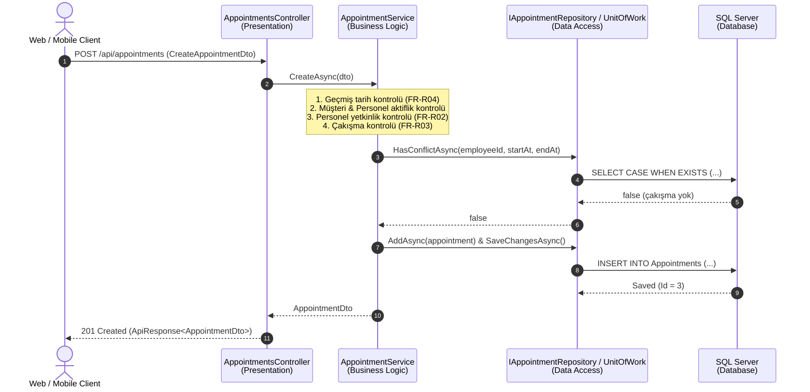

# BarberAppointment — Gün 7: Service ve Business Katmanı

**Kapsam:** Business Logic (İş Mantığı), Service Pattern, DTO (Data Transfer Object), Entity/DTO ayrımı; Service arayüzleri ve implementasyonları; Controller -> Service -> Repository -> Database uçtan uca mimari akışı ve canlı API testleri.

---

## 1. Araştırılacak Temel Konular

### 1.1 Business Logic (İş Mantığı) Nedir?
- **Tanım:** Bir uygulamanın gerçek dünya kurallarını, kısıtlamalarını, hesaplamalarını ve veri doğrulama mantığını ifade eden çekirdek kurallar bütünüdür.
- **Örnekler (Kuaför Domain'i):**
  - Seçilen personel talep edilen hizmeti verebiliyor mu?
  - Personelin o saat aralığında çakışan başka bir randevusu var mı?
  - Randevu başlangıç saatine hizmet süresi eklenerek bitiş zamanı ne olmalı?
  - Geçmiş tarihe randevu alınamaz; tamamlanmış randevu iptal edilemez.
- **Neden Service Katmanında Olmalıdır?**  
  İş kuralları Controller içinde yazılırsa API istemcisi değiştiğinde (örneğin gRPC veya Console eklendiğinde) kod tekrarı oluşur; veritabanı veya Entity içine yazılırsa altyapı bağımlılığı artar ve test edilebilirlik zorlaşır.

### 1.2 Service Pattern (Servis Deseni) Nedir?
- **Tanım:** Uygulamanın kullanım senaryolarını (Use Cases) ve iş akışlarını orkestre eden, Controller ile Repository arasında duran servis katmanıdır.
- **Sorumlulukları:**
  1. Gelen DTO'ları doğrulamak ve iş kurallarını denetlemek.
  2. Gerekli Repository çağrılarını yapmak (`IUnitOfWork` üzerinden).
  3. Domain entity'lerini DTO'lara dönüştürüp üst katmana iletmek.
  4. Hata durumlarında anlamlı domain istisnaları (`BusinessException`, `NotFoundException`, `ConflictException`) fırlatmak.

### 1.3 DTO (Data Transfer Object) Nedir?
- **Tanım:** Katmanlar arasında (özellikle Web API ile istemci arasında) yalnızca veri taşımak amacıyla kullanılan, iş mantığı barındırmayan saf veri nesneleridir (`POCO`).
- **Neden Kullanılır?** İstemcinin gönderdiği JSON ile veritabanı entity'si birebir aynı olmak zorunda değildir.

### 1.4 Entity / DTO Ayrımı Neden Hayatidir?

| Karşılaştırma Kriteri | Entity (Varlık) | DTO (Veri Transfer Nesnesi) |
| :--- | :--- | :--- |
| **Amaç** | Veritabanı tablosunu ve ilişkilerini modellemek | İstemciye gösterilecek / istemciden alınacak veriyi taşımak |
| **Güvenlik** | Doğrudan API'ye açılırsa *Mass Assignment (Overposting)* zafiyeti doğar | Yalnızca izin verilen alanları açarak güvenliği sağlar |
| **Döngüsel Referans** | Entity'ler birbirine bağlıdır (`User -> Appointment -> User`), JSON serileştirmede sonsuz döngüye girer | Düzleştirilmiş (Flat) yapısıyla döngüleri engeller |
| **Bağımsızlık** | Veritabanı şeması değiştiğinde etkilenir | API sözleşmesini (Contract) korur, istemcileri kırmaz |

---

## 2. Uçtan Uca Mimari Akış: Controller -> Service -> Repository -> Database



---

## 3. Uygulanan İş Kuralları Matrisi

| Kural Kodu | Kural Tanımı | Gerçekleştirildiği Yer | Hata Yanıtı |
| :--- | :--- | :--- | :--- |
| **FR-R04** | Geçmiş zamana randevu oluşturulamaz | `AppointmentService.CreateAsync` | `400 Bad Request` |
| **FR-K03** | Yalnızca aktif müşteriler randevu alabilir | `AppointmentService.CreateAsync` | `400 Bad Request` |
| **FR-P03** | Yalnızca aktif personel için randevu oluşturulabilir | `AppointmentService.CreateAsync` | `400 Bad Request` |
| **FR-H03** | Yalnızca aktif hizmetler seçilebilir | `AppointmentService.CreateAsync` | `400 Bad Request` |
| **FR-R02** | Seçilen personel o hizmeti verebiliyor olmalıdır | `AppointmentService.CreateAsync` | `400 Bad Request` |
| **FR-R03** | Aynı personelin aynı saatte ikinci randevusu olamaz | `AppointmentService.CreateAsync` & `HasConflictAsync` | `409 Conflict` |
| **FR-H04** | Bitiş zamanı `StartAt + DurationMinutes` olarak hesaplanır | `AppointmentService.CreateAsync` | Otomatik hesaplanır |
| **FR-R07** | Tamamlanan randevu iptal edilemez | `AppointmentService.CancelAsync` | `400 Bad Request` |
| **FR-R06** | İptal edilen randevu slot'u boşa çıkar | `AppointmentService.CancelAsync` | `200 OK` |

---

## 4. Servis Katmanı Proje Yapısı

```
src/libraries/BarberAppointment.Services/
├── DTOs/
│   ├── AppointmentDto.cs         # AppointmentDto, CreateAppointmentDto
│   ├── EmployeeDto.cs            # EmployeeDto, CreateEmployeeDto, AssignServicesDto
│   ├── ServiceDto.cs             # ServiceDto, CreateServiceDto
│   └── UserDto.cs                # UserDto, CreateUserDto
├── Interfaces/
│   ├── IAppointmentService.cs
│   ├── IEmployeeService.cs
│   ├── IServiceManagementService.cs
│   └── IUserService.cs
├── Implementations/
│   ├── AppointmentService.cs     # Tüm randevu iş kuralları & çakışma yönetimi
│   ├── EmployeeService.cs        # Personel oluşturma & hizmet atama
│   ├── ServiceManagementService.cs# Hizmet oluşturma & listeleme
│   └── UserService.cs            # Tekil e-posta kontrolü & kullanıcı yönetimi
└── Extensions/
    └── ServiceRegistration.cs    # AddBusinessServices() Scoped DI kaydı
```

---

## 5. Canlı API Doğrulama ve Test Çıktıları

1. **Personel Hizmet Yetkinlik Kuralı Testi (FR-R02):**  
   Mehmet Usta'ya sakal tıraşı randevusu verilmek istendiğinde kural devreye girdi:
   ```json
   {
     "success": false,
     "errors": ["'Mehmet Usta' personeli 'Sakal tıraşı' hizmetini sunmamaktadır."]
   }
   ```

2. **Geçmiş Tarih Kuralı Testi (FR-R04):**  
   Geçmiş zamana randevu isteği reddedildi:
   ```json
   {
     "success": false,
     "errors": ["Geçmiş bir zamana randevu oluşturulamaz."]
   }
   ```

3. **Başarılı Randevu Oluşturma:**  
   Kuralları sağlayan randevu oluşturuldu ve bitiş saati otomatik hesaplandı (`2026-08-28 10:00 - 10:30`):
   ```json
   {
     "success": true,
     "message": "Randevu başarıyla oluşturuldu.",
     "data": {
       "id": 3,
       "customerName": "Ayşe Demir",
       "employeeName": "Mehmet Usta",
       "serviceName": "Saç kesimi",
       "price": 250.00,
       "durationMinutes": 30,
       "startAt": "2026-08-28T10:00:00",
       "endAt": "2026-08-28T10:30:00",
       "status": 2
     }
   }
   ```

4. **Randevu İptali ve İkinci İptal Koruması:**  
   - İlk iptal: `200 OK` ("Randevu başarıyla iptal edildi.")
   - İkinci iptal denemesi: `400 Bad Request` ("Bu randevu zaten iptal edilmiştir.")
